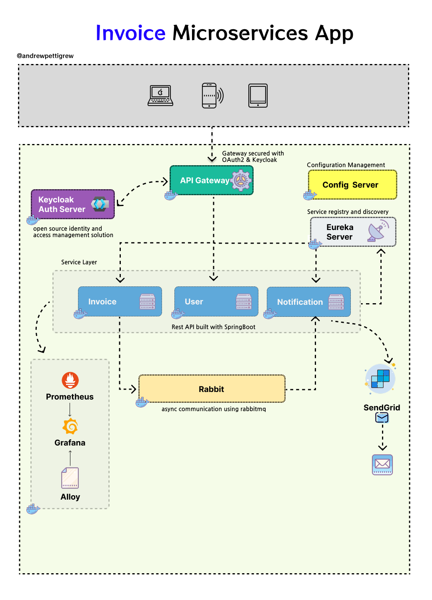

# SaaS Invoice Microservices App with SpringBoot, Docker, Kubernetes


The Invoice microservice app is a simple invoice management app built to demonstrate the Microservices Architecture Pattern using SpringBoot, 
Spring Cloud, Docker and Kubernetes. 

## 📝 Project Brief 
The Invoice Management System is a full-stack web application that enables users to efficiently create, read, update, and delete invoices while maintaining clear visibility into payment statuses. 
It’s designed with a focus on, microservices patterns, data validation, and state management best practices reflecting real-world billing workflows used by freelancers and small businesses.

## 🎯 Purpose
The project is intended as a pure learning process to try out various concepts in a microservices and distributed environment.
You are free to fork it and turn into something else or even provide cool updates via pull request. I'm happy to collab.

## Core Features
1. CRUD Functionality 
- Create new invoices through an intuitive form. 
- Read and display invoices in a structured dashboard. 
- Update invoices to adjust client info, payment terms, or amounts. 
- Delete invoices permanently with confirmation prompts.

🧾 2. Form Validation & Data Integrity
- Built-in form validation ensures that all required fields (e.g., client name, due date, items, total) are filled before submission. 
- Inline error messages guide the user to fix invalid inputs. 
- Prevents malformed or incomplete invoices from being submitted.

💾 3. Drafts & Payment Status Management
- Users can save invoices as drafts when details are incomplete. 
- Mark invoices as paid when payment is received. 
- Automatically transitions between Draft, Pending, and Paid states.

🔍 4. Filtering by Status
- Dynamic filtering allows users to view invoices by status:
  - 📝 Draft 
  - ⏳ Pending 
  - ✅ Paid


## Tech Stack
- Backend: Java (Spring Boot / Spring Cloud ecosystem)
- Configuration: Spring Cloud Config & Spring Cloud Bus
- Service Discovery: Netflix Eureka
- API Gateway: Spring Cloud Gateway
- Messaging Queues: Spring Cloud Stream
- Observability & Monitoring: Prometheus, Grafana, Loki, Alloy
- Containerization/Orchestration: Docker, Kubernetes + Helm charts
- Version Control: Git & GitHub

## Tutorial overview
https://code2tutorial.com/tutorial/66218165-f888-4dc1-bd18-ed3466c91ee9/index.md

## Authentication and Authorization
### Password Reset Flow

1. **User requests password reset**
  - Endpoint: `POST /auth/forgot-password`
  - Payload: `{ "email": "user@example.com" }`

2. **System processes request**
  - Finds the user in Keycloak
  - Sends a reset email to the user

3. **User receives email**
  - Email contains a **reset link** with a token/key

4. **User submits new password**
  - Endpoint: `POST /auth/reset-password`
  - Payload: `{ "token": "reset-token", "newPassword": "NewPassword123!" }`

5. **System validates token**
  - Calls Keycloak REST API to **reset the password**
  - Confirms success to the user


## Functional services

The Invoice System is composed into three core microservices. Each application is independently deployable and structured around specific business domains.

****

#### User service
Contains general logic to create/register a user to the open source Keycloak Identity Access and Management Server.

| Endpoint Name  | Method | URL                    | Description                      |  
|---------------|--------|------------------------|----------------------------------|  
| create-users  | POST   | `{{user_url}}`         | Create a new user account       |  
| update-users  | PATCH  | `{{user_url}}/:id`     | Update user details             |  
| get all users | GET    | `{{user_url}}?page=0&size=10` | Retrieve a paginated list of users |  
| get single user | GET    | `{{user_url}}/:id`     | Retrieve details of a specific user |  
| delete-users  | DELETE | `{{user_url}}/:id`     | Delete a user account           |  


#### Invoice service
Performs the CRUD operations required to manage an invoice.

| Endpoint Name       | Method  | URL                          | Description                        |  
|---------------------|--------|------------------------------|------------------------------------|  
| create invoice     | POST   | `{{invoice_url}}`            | Create a new invoice              |  
| get all invoices   | GET    | `{{invoice_url}}?page=0&size=10` | Retrieve a paginated list of invoices |  
| get single invoice | GET    | `{{invoice_url}}/:id`        | Retrieve details of a specific invoice |  
| update invoice     | PATCH  | `{{invoice_url}}/:id`        | Update details of an invoice      |  
| delete invoice     | DELETE | `{{invoice_url}}/:id`        | Delete an invoice                 |  
| contact-info       | GET    | `{{invoice_url}}/contact-info` | Retrieve invoice-related contact info |  
| bus refresh       | POST   | `{{invoice_url}}/actuator/busrefresh` | Refresh configuration bus |  


#### Notification service
Sends an email via SendGrid API whenever an invoice has been created, updated or deleted. This serves as an eg of standalone service to manage all notification in the system. Can be extended to send sms, send reminder etc.  
Currently this is implemented as a Spring Cloud function that receives event from a message broker and sends an email to the client who is the recipient of an invoice.

## Infrastructure
[Spring cloud](https://spring.io/projects/spring-cloud) provides powerful tools for developers to quickly implement common distributed systems patterns  


### Config Server
[Spring Cloud Config](http://cloud.spring.io/spring-cloud-config/spring-cloud-config.html) is horizontally scalable centralized configuration service for the distributed systems. It uses a pluggable repository layer that currently supports local storage, Git, and Subversion. In this project, the config server connects with a github repository to pull configuration for the different microservices. You can see shared configuration repo here [invoice-config-server](https://github.com/apettiigrew/invoice-config-server).

##### Spring Cloud Config Server & Spring Cloud Bus
With the Config Server you have a central place to manage external properties for applications across all environments. [Spring Cloud Bus](https://spring.io/projects/spring-cloud-bus), facilitates seamless communication between all connected application instances by establishing a convenient event broadcasting channel. It offers an implementation for AMQP brokers, such as RabbitMQ, and Kafka. Spring Cloud Config offers the Monitor library, which enables the triggering of configuration change events in the Config Service. By exposing the /monitor endpoint, it facilitates the propagation of these events to all listening applications via the Bus. The Monitor library allows push notifications from popular code repository providers such as GitHub.
### Service Discovery

[](https://github.com/sqshq/piggymetrics/blob/master/README.md#service-discovery)

Service Discovery allows automatic detection of the network locations for all registered services. These locations might have dynamically assigned addresses due to auto-scaling, failures or upgrades.

The key part of Service discovery is the Registry. In this project, we use Netflix Eureka. Eureka is a good example of the client-side discovery pattern, where client is responsible for looking up the locations of available service instances and load balancing between them.

With Spring Boot, you can easily build Eureka Registry using the  `spring-cloud-starter-eureka-server` dependency,  `@EnableEurekaServer` annotation and simple configuration properties.

### API Gateway

API Gateway is a single entry point into the system, used to handle requests and routing them to the appropriate backend service.  In this project the gateway also provide security measures by only allow authorized request via OAuth2 using Keycloak as an authorization server to grant permissions to handle various request.

### Observability
Observability reveals a system's internal state through its outputs. In microservices, this is achieved by analyzing metrics, logs, and traces.

In this project we managed logs by utilizing Grafana Loki & Grafan Alloy. Grafana is a popular tool for visualizing metrics, logs, and traces from a variety of sources.

- Grafana Loki is a horizontally scalable, highly available, and cost-effective log aggregation system. It is designed to be easy to use and to scale to meet the needs of even the most demanding applications.

- Grafana Alloy is a lightweight log agent that ships logs from your containers to Loki. It is easy to configure and can be used to collect logs from a wide variety of sources.

- Prometheus acts as our monitoring system that gives developers valuable insights into the health and performance of their software

All these tools feed data into Grafana that allows us to visualize and analyze the data in a user-friendly way.


### Logging with Loki+Alloy
...
### Metrics with Prometheus
...
### Traces with Tempo
...

****

### Event Driven Model
We've added a publisher/subscriber model using RabbitMQ to distributes events to our notification service.  Our Notification service handles events via spring cloud function that subscribes to the message queue.

### Important endpoints

| **Service**       | **URL**                                                         |
|-------------------|-----------------------------------------------------------------|
| **Config Server** | http://localhost:8071/                                          |
| **Keycloak Server** | http://localhost:7080/                                          |
| **Eureka Server** | http://localhost:8070/                                          |
| **Grafana**       | http://localhost:3000/                                          |
| **Prometheus**    | http://localhost:9090/targets                                   |
| **Metrics**       | server_url/actuator/metrics <br> server_url/actuator/prometheus |

### Resilience Patterns
This project uses Resilience4j is a lightweight fault tolerance library designed for functional programming. Resilience4j provides higher-order functions (decorators) to enhance any functional interface, lambda expression or method reference with a Circuit Breaker, Rate Limiter, Retry or Bulkhead.

https://resilience4j.readme.io/docs/getting-started
#### Circuit breaker
The circuit breaker is added in apigateway server. The Circuit Breaker pattern prevents system failures from \
cascading when calling remote services. It monitors failures and, if a service fails repeatedly, it “trips” to fail fast and protect the system. Once the service recovers, calls are allowed again.
```
.route(p -> p
    .path("/api/v1/invoices/**")
    .filters(f -> f
        .rewritePath("/petti/invoices/(?<segment>.*)", "/${segment}")
        .addResponseHeader("X-Response-Time", LocalDateTime.now().toString())
        .circuitBreaker(config -> 
            config.setName("invoicesCircuitBreaker"))
    )
    .uri("lb://INVOICES")
)
```
#### Retry

Retry logic automatically retries failed operations, typically for transient errors like network timeouts, to improve reliability and ensure successful execution without manual intervention.

```
.route(p -> p
    .path("/api/v1/invoices/**")
    .filters( f -> f.rewritePath("/petti/invoices/(?<segment>.*)","/${segment}")
            .retry((retryConfig ->
                    retryConfig.setRetries(2)
                    .setMethods(HttpMethod.GET)
                            .setBackoff(Duration.ofMillis(100),Duration.ofMillis(1000),2,true))))

    .uri("lb://INVOICES"))
```
#### Rate Limiting
Rate limiting controls how many requests a user or client can make to a service in a given time period. It prevents abuse, ensures fair usage, and protects system resources.
```
@Bean
	public RouteLocator customRouteLocator(RouteLocatorBuilder routeLocatorBuilder) {
		return routeLocatorBuilder.routes()
          .route(p -> p
            .path("/api/v1/invoices/**")
            .filters( f -> f.rewritePath("/petti/invoices/(?<segment>.*)","/${segment}")
              .addResponseHeader("X-Response-Time", LocalDateTime.now().toString())
              .circuitBreaker(config->config.setName("invoicesCircuitBreaker"))
              .retry((retryConfig ->
                      retryConfig.setRetries(2)
                      .setMethods(HttpMethod.GET)
                              .setBackoff(Duration.ofMillis(100),Duration.ofMillis(1000),2,true))))
            .uri("lb://INVOICES"))
        .route(p -> p
            .path("/api/v1/users/**")
            .filters( f -> f.rewritePath("/petti/users/(?<segment>.*)","/${segment}")
              .addResponseHeader("X-Response-Time", LocalDateTime.now().toString())
              .requestRateLimiter(config ->
                config.setRateLimiter(redisRateLimiter())
                  .setKeyResolver(keyResolver())))
            .uri("lb://USERS")).build();
	}
	
@Bean
public RedisRateLimiter redisRateLimiter(){
    return new RedisRateLimiter(5,5,1);
}

@Bean
public KeyResolver keyResolver(){
    return exchange -> Mono.justOrEmpty(Objects.requireNonNull(exchange.getRequest().getRemoteAddress()).getAddress().getHostAddress());
}
```

### Kubernetes + Helm
There are also helm charts created for each service in the ecosystem. 
The charts are located in the `helm` directory. 

### Contributions are welcome!
Invoice Microservice system is open source, and would greatly appreciate your help. Feel free to suggest and implement any improvements.
